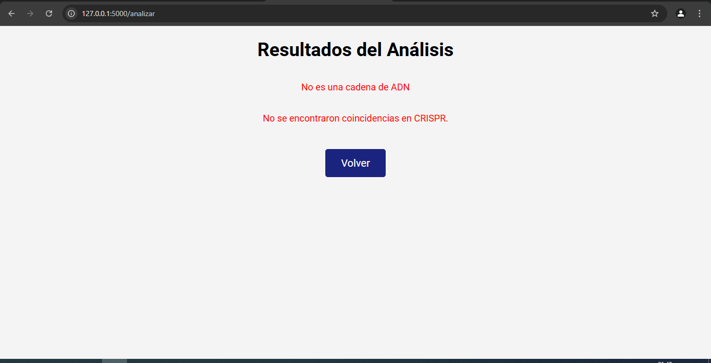
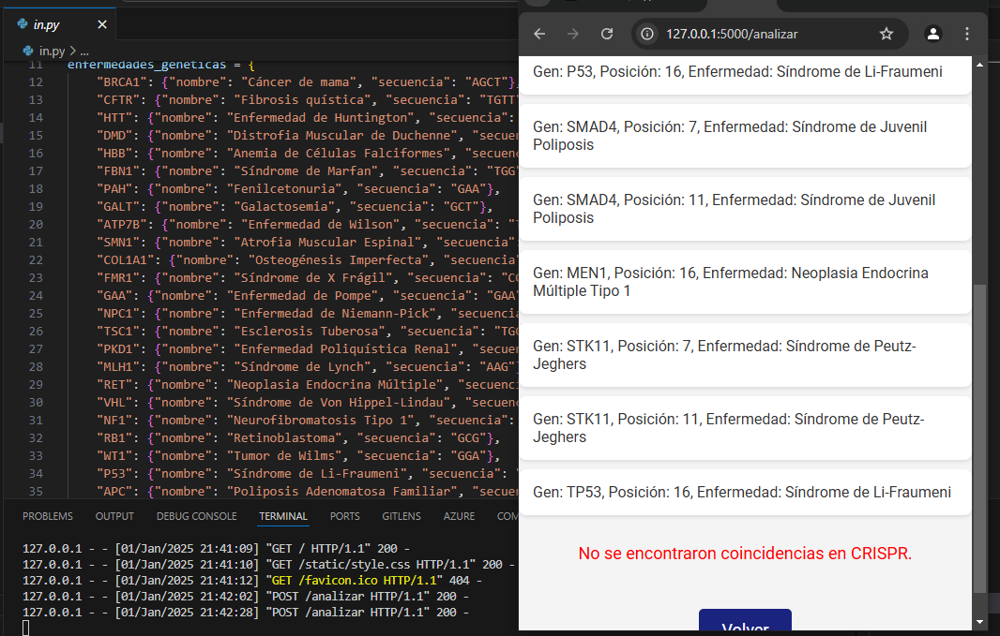

**Interface of the website**

# Description 
- A **bioinformatics** application made with **Flask** (Python) whose objective is to consult genomic data is a brief database in json format, the idea is that the user enters sequences of nitrogenous DNA bases and they are searched in the standard database and in another that contains possible DNA strands that present repairable mutations using the **CRISPR Cas9 system**. The app also provides information on the topics covered and is a simple example of personal training.

**The web site is in spanish**

You can find here some useful tools to bioinformatic engineers, this project is a personal practice for the University of Informatics Sciences at 2025 year.

